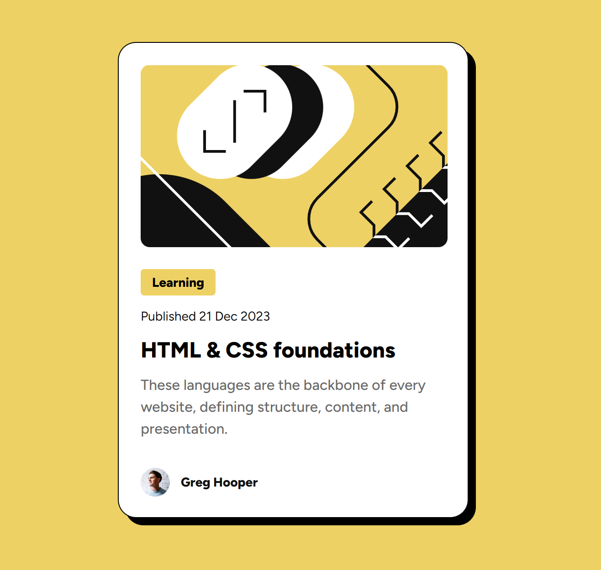

# Frontend Mentor - Blog preview card solution

This is a solution to the [Blog preview card challenge on Frontend Mentor](https://www.frontendmentor.io/challenges/blog-preview-card-ckPaj01IcS). Frontend Mentor challenges help you improve your coding skills by building realistic projects. 

## Table of contents

- [Overview](#overview)
  - [The challenge](#the-challenge)
  - [Screenshot](#screenshot)
  - [Links](#links)
- [My process](#my-process)
  - [Built with](#built-with)
  - [What I learned](#what-i-learned)
- [Author](#author)

## Overview

### The challenge

Users should be able to:

- See hover and focus states for all interactive elements on the page

### Screenshot

### Links

- Solution URL: [Add solution URL here](https://github.com/ballemily02/blog-post)
- Live Site URL: [Add live site URL here](https://blog-post-emilys-projects-e3e65b1f.vercel.app/)

## My process

### Built with

- HTML
- CSS
- Flexbox

### What I learned

This second project really allowed me to get much faster with creating and implamenting the HTML components and then styling them with CSS. I feel I also gained much more understanding of flexbox throughout this challenge.

## Author

- Frontend Mentor - [@ballemily02](https://www.frontendmentor.io/profile/ballemily02)

